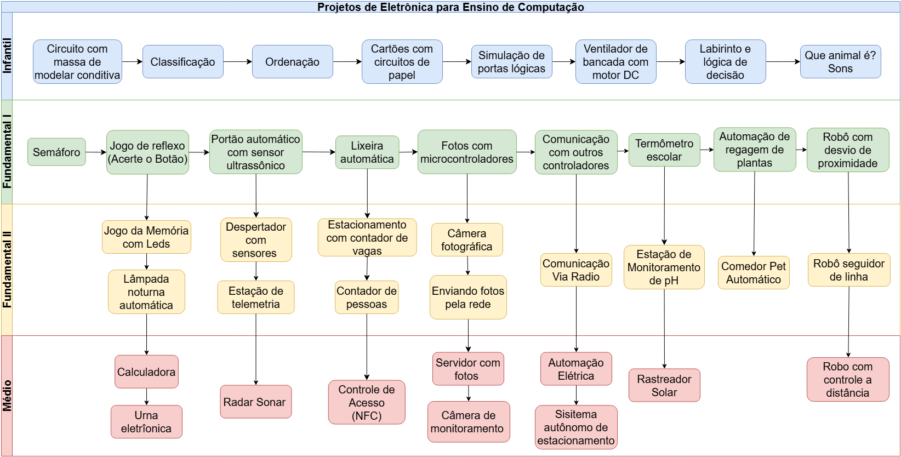
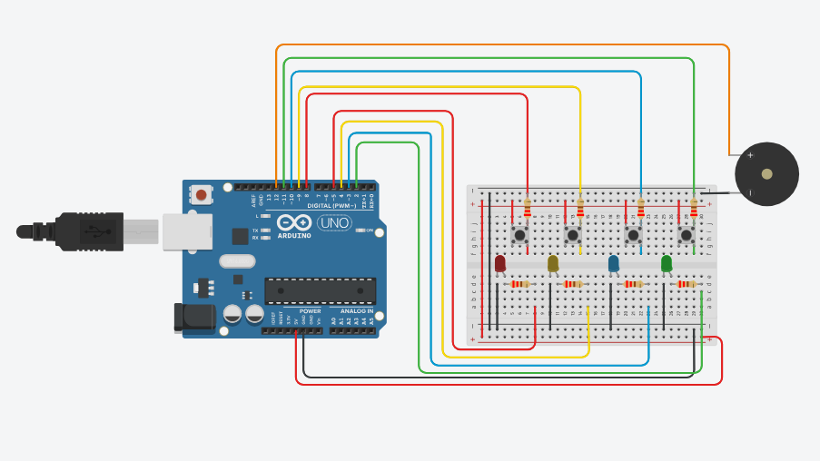
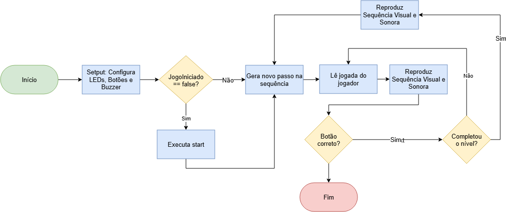

# 📚 Manual Didático de Computação: Metodologia e Montagem para Laboratórios Escolares

<div align="center">


<p align="center">
  <strong>Guia Prático, Modular e Interdisciplinar para o Ensino de Ciência da Computação e Sistemas Embarcados na Educação Básica</strong>
</p>

[](LICENSE)
[](#marco-regulatório-e-fundamentação)
[](#arquitetura-e-ecossistema-de-ferramentas)
[](#arquitetura-e-ecossistema-de-ferramentas)
[](#)

</div>

---

## 📖 Visão Geral e Contexto

A trajetória da inclusão das Tecnologias de Informação e Comunicação (TIC) nas escolas brasileiras frequentemente priorizou a aquisição de equipamentos em detrimento da apropriação científica da Computação. O modelo predominante manteve o computador como uma ferramenta instrumental (digitação, pesquisas e softwares educativos fechados), tratando a tecnologia como uma **"caixa-preta"**.

Este manual rompe com essa visão tecnicista. Alinhado às diretrizes da **Base Nacional Comum Curricular (BNCC)** e à **Resolução CNE/CEB nº 1/2022**, o projeto propõe o desenvolvimento do **Pensamento Computacional** e da computação física como instrumentos de emancipação e autoria tecnológica.

### 🏛️ Pilares Epistemológicos e Metodológicos

* **Seymour Papert (Construcionismo):** A aprendizagem de conceitos abstratos de lógica e algoritmos atinge seu ápice quando mediada pela criação tangível de artefatos no mundo físico (sensores, circuitos, robôs e atuadores).
* **Paulo Freire (Pedagogia da Autonomia):** Superação da passividade do aluno consumidor para a formação de sujeitos conscientes, capazes de questionar, projetar e transformar sua realidade sócio-tecnológica.
* **Viabilidade Pública e Acesso Universal:** Priorização de plataformas de código aberto (*Open Source*), ferramentas gratuitas na nuvem (Tinkercad, Wokwi) e componentes de baixo custo para permitir a implementação em larga escala em redes públicas de ensino.

---

## 🗺️ Fluxograma Panorâmico de Progressão Pedagógica

A sequência didática organiza-se de forma progressiva e contínua em **4 Módulos Curriculares**, respeitando as fases de maturação cognitiva desde a Educação Infantil até o Ensino Médio:

<div align="center">
  
</div>

<br>

<table width="100%">
  <thead>
    <tr style="background-color: #0f172a; color: #ffffff;">
      <th align="center" width="12%">Módulo</th>
      <th align="left" width="28%">Etapa de Ensino</th>
      <th align="left" width="40%">Foco Didático e Competências</th>
      <th align="center" width="20%">Abordagem Tecnológica</th>
    </tr>
  </thead>
  <tbody>
    <tr>
      <td align="center"><strong>MÓD. I</strong></td>
      <td><strong>Educação Infantil</strong></td>
      <td>Percepção espacial, decomposição lúdica, reconhecimento de padrões e circuitos básicos de condutividade.</td>
      <td><span style="background:#dcfce7;color:#166534;padding:2px 8px;border-radius:4px;font-size:12px;font-weight:bold;">Computação Desplugada</span></td>
    </tr>
    <tr>
      <td align="center"><strong>MÓD. II</strong></td>
      <td><strong>Ensino Fundamental I</strong></td>
      <td>Lógica de blocos, automação elementar, controle sequencial e introdução a sensores de luz e proximidade.</td>
      <td><span style="background:#e0f2fe;color:#075985;padding:2px 8px;border-radius:4px;font-size:12px;font-weight:bold;">Tinkercad & Scratch</span></td>
    </tr>
    <tr>
      <td align="center"><strong>MÓD. III</strong></td>
      <td><strong>Ensino Fundamental II</strong></td>
      <td>Programação textual em C++, manipulação de vetores, variáveis, debounce, interrupções e eletrônica analógica/digital.</td>
      <td><span style="background:#fef3c7;color:#92400e;padding:2px 8px;border-radius:4px;font-size:12px;font-weight:bold;">Arduino C++ & Sensores</span></td>
    </tr>
    <tr>
      <td align="center"><strong>MÓD. IV</strong></td>
      <td><strong>Ensino Médio</strong></td>
      <td>Internet das Coisas (IoT), comunicação Wi-Fi/HTTP, telemetria em nuvem, servomotores, automação residencial e robótica móvel.</td>
      <td><span style="background:#fee2e2;color:#991b1b;padding:2px 8px;border-radius:4px;font-size:12px;font-weight:bold;">ESP32, ESP8266 & Wokwi</span></td>
    </tr>
  </tbody>
</table>

---

## 🛠️ Ecossistema de Ferramentas Digitais

O manual estabelece um fluxo integrado entre projeto virtual, versionamento e prototipagem física:

<div align="center">

| Ferramenta | Logo | Aplicação Didática |
| :--- | :---: | :--- |
| **Tinkercad** |  | Simulação virtual gratuita no navegador, permitindo experimentação e teste sem risco de queima de componentes. |
| **Wokwi** |  | Simulação avançada de microcontroladores ESP32/ESP8266 com validação de stacks de rede Wi-Fi e IoT diretamente no browser. |
| **Arduino IDE** |  | Ambiente de compilação, carga de firmware e monitoramento serial para validação na bancada física. |
| **GitHub** |  | Repositório aberto e rastreável com acesso direto via QR Codes integrados em cada página do manual. |

</div>

---

## 💡 Projeto em Destaque: PRJ 3.1 - Jogo da Memória com LEDs (Genius / Simon)

O **PRJ 3.1** consolida a transição dos alunos para o controle estruturado de estados, indexação vetorial e leitura de sinais digitais no Ensino Fundamental II.

<div align="center">
  <span style="background:#f1f5f9;color:#0f172a;padding:4px 12px;border-radius:16px;font-weight:bold;font-size:13px;border:1px solid #cbd5e1;">Módulo III</span>
  &nbsp;
  <span style="background:#fef3c7;color:#92400e;padding:4px 12px;border-radius:16px;font-weight:bold;font-size:13px;border:1px solid #fde68a;">Complexidade: Intermediário</span>
  &nbsp;
  <span style="background:#e0e7ff;color:#3730a3;padding:4px 12px;border-radius:16px;font-weight:bold;font-size:13px;border:1px solid #c7d2fe;">Tempo Estimado: 2 h/aula (100 min)</span>
</div>

<br>

### 📜 Contextualização Histórica e Problema Real
> *"Lançado no final da década de 1970 no Studio 54 em Nova York, o Simon (Genius no Brasil) provou que sistemas microcontrolados simples podiam criar interações sofisticadas de padrão áudio-visual. Como modelar a lógica de geração de sequências dinâmicas, o armazenamento em vetores indexados e a validação em tempo real das entradas do usuário utilizando um microcontrolador moderno?"*

### 🔄 Diagrama de Fluxo Lógico do Firmware


### 📐 Modelagem de Engenharia e Roteiro de Montagem

<div align="center">

| Esquema Elétrico na Protoboard | Fluxograma Lógico-Algorítmico |
| :---: | :---: |
|  |  |
| *Conexão dos 4 LEDs (D2-D5), 4 botões (D8-D11) com pull-down e buzzer (D12).* | *Estrutura de decisão, amostragem de ruído em A0 e verificação da sequência.* |

</div>

<br>

### 💻 Trecho do Código-Fonte do Projeto (Arduino C++)

```cpp
// ==============================================================================
// PRJ 3.1: Jogo da Memória com LEDs (Genius / Simon) - Loop Principal
// ==============================================================================

void loop() {
  if (!jogoIniciado) {
    start();
    // Geração de semente de entropia a partir do ruído eletromagnético em pino flutuante
    randomSeed(analogRead(A0));
    jogoIniciado = true;
    delay(500);
  }

  // Gera o novo passo aleatório da sequência
  filaOriginal[nivel - 1] = random(0, numPares);
  reproduzirSequencia();
  delay(100);

  // Validação da jogada do usuário em tempo real
  for (uint16_t i = 0; i < nivel; i++) {
    int botaoPressionado = -1;

    while (botaoPressionado == -1) {
      botaoPressionado = espelharBotoesNosLeds();
    }

    // Debounce por filtro temporal para estabilização de contato mecânico
    delay(40);

    if (botaoPressionado != filaOriginal[i]) {
      Serial.println("-> Erro: Sequência incorreta. Game Over!");
      gameOver();
      return;
    }

    // Aguarda o usuário soltar o botão
    while (espelharBotoesNosLeds() != -1) {
      delay(10);
    }
  }

  Serial.println("-> Sequência correta! Avançando de nível...");
  nivel++;
  delay(1000);
}
```

* **Simulação Interativa:** [Acessar Projeto no Autodesk Tinkercad](https://www.tinkercad.com/things/66hrvqjr0HT-jogo-da-memoria?sharecode=7-SX2pF2aCBu4g14pAuLQF0axR53FBzI9UjHQ8CZ5nE)

---

## ⚙️ Arquitetura dos Geradores e Engenharia do Projeto

A documentação da aplicação adota o princípio de **Fonte Única da Verdade (SSOT)** associado a geradores em lote escritos em Python:

```text
.
├── Manual.html                    # [SSOT] Fonte Única da Verdade (Documentação de Referência)
├── Manual_Completo_Atualizado.html# Manual Consolidado com a grade completa (39 projetos)
├── style.css                      # Estilos rigorosos para visualização de tela e impressão A4
├── gerar_projetos_refatorado.py   # Motor de diagramação, paginação e compilação do livro
├── atualizar_manual.py            # Processador de matrizes curriculares e competências
├── dados_manual.txt               # Base de dados estruturada dos 4 Módulos Curriculares
├── projetos_estrutura.txt         # Banco de dados com os 39 projetos detalhados
├── projetos_estruturas.txt        # Base canônica reduzida (projeto piloto)
├── Projetos.png                   # Infográfico do Fluxograma Panorâmico
├── Capa.png                       # Arte editorial da capa acadêmica
└── projetos/                      # Diagramas elétricos e fluxogramas individuais
    ├── PRJ_3_1_esquema.png
    └── PRJ_3_1_Fluxograma.png
```

### 🚀 Como Compilar e Gerar os Manuais

Certifique-se de possuir o Python 3.10+ e a biblioteca `beautifulsoup4` instalados:

```bash
pip install beautifulsoup4
```

#### 1. Gerar o Manual Piloto (`Manual.html`):
```bash
python gerar_projetos.py
```

#### 2. Compilar o Manual Completo com todos os 39 Projetos (`Manual_Completo_Atualizado.html`):
```bash
python -c "import gerar_projetos_refatorado; gerar_projetos_refatorado.executar_automacao(arq_origem='Manual.html', arq_json='projetos_estrutura.txt', arq_destino='Manual_Completo_Atualizado.html')"
```

#### 3. Exportar para PDF:
Abra qualquer um dos arquivos `.html` no navegador (Chrome, Edge ou Firefox) e clique no botão flutuante **"Gerar PDF / Imprimir"** ou pressione `Ctrl + P`. O layout `@media print` já está estritamente ajustado para folha A4 com margens simétricas.

---

<div align="center">
  <sub>Desenvolvido no âmbito do curso de Ciência da Computação • Foco em Práxis Libertadora, Hardware Livre e Democratização Tecnológica.</sub>
</div>
